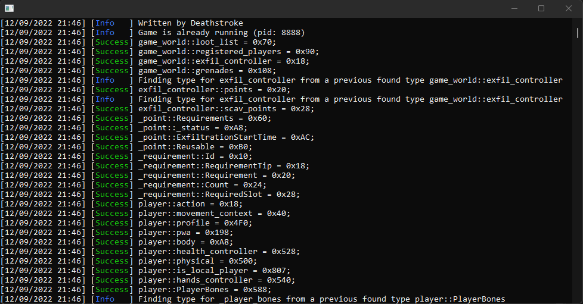

<p align="center">
  
</p>

# TOG : Tarkov Offsets Generator
(Very) simple Escape From Tarkov offsets generator using Unispect and made with .NET 6.
Just an old project I decided to publish here on GitHub, nothing special you are warned :)

# How to compile
Use Visual Studio 2022, select "Release" and compile. Compiled files goes in root `bin` directory.

# How to use
Simply run the game without the anticheat (battleyent does the trick but shouldn't be required), then run the application.
Ouput files goes in the root `Output` directory.

# Output exemple
```
#pragma once
#include "stdafx.h"

/*
	Generated using Deathstroke's TGO (https://github.com/patrickcjk/tog)
	At 12/09/2022 21:46:46
	Game version 0.12.12.31.19428
*/

namespace offsets
{
	// [Class] EFT.GameWorld
	namespace game_world
	{
		constexpr auto size = 0x188;
		constexpr auto max_use_size = 0x110; // 0x108 + sizeof(-.GClass0621<Int32, Throwable>) = 0x108 + 0x8

		constexpr auto loot_list = 0x70; // [70] LootList : System.Collections.Generic.List<GInterface1586>
		constexpr auto registered_players = 0x90; // [90] RegisteredPlayers : System.Collections.Generic.List<Player>
		constexpr auto exfil_controller = 0x18; // [18] gClass0C21_0x18 : -.GClass0C21
		constexpr auto grenades = 0x108; // [108] Grenades : -.GClass0621<Int32, Throwable>
	}

	// [Class] EFT.Player
	namespace player
	{
		constexpr auto size = 0x808;
		constexpr auto max_use_size = 0x808; // 0x807 + sizeof(Boolean) = 0x807 + 0x1

		constexpr auto action = 0x18; // [18] action_0x18 : System.Action<Single, Single, Int32>
		constexpr auto movement_context = 0x40; // [40] gClass10BD_0x40 : -.GClass10BD
		constexpr auto profile = 0x4F0; // [4F0] profile_0x4F0 : EFT.Profile
		constexpr auto pwa = 0x198; // [198] proceduralWeaponAnimation_0x198 : EFT.Animations.ProceduralWeaponAnimation
		constexpr auto body = 0xA8; // [A8] _playerBody : EFT.PlayerBody
		constexpr auto health_controller = 0x528; // [528] _healthController : -.GInterface80F7
		constexpr auto physical = 0x500; // [500] Physical : -.GClass05B8
		constexpr auto is_local_player = 0x807; // [807] boolean_0x807 : Boolean
		constexpr auto hands_controller = 0x540; // [540] _handsController : -.Player.AbstractHandsController
		constexpr auto PlayerBones = 0x588; // [588] PlayerBones : -.PlayerBones

		// [Class] -.PlayerBones
		namespace _player_bones
		{
			constexpr auto size = 0x208;
			constexpr auto max_use_size = 0x150; // 0x148 + sizeof(EFT.BifacialTransform) = 0x148 + 0x8

			constexpr auto fireport = 0x148; // [148] Fireport : EFT.BifacialTransform
		}

		// [Class] -.GClass05B8
		namespace _physical
		{
			constexpr auto size = 0x120;
			constexpr auto max_use_size = 0x40; // 0x38 + sizeof(-.GClass05B6) = 0x38 + 0x8

			constexpr auto stamina = 0x38; // [38] Stamina : -.GClass05B6

			// [Class] -.GClass05B6
			namespace _stamina
			{
				constexpr auto size = 0x60;
				constexpr auto max_use_size = 0x4C; // 0x48 + sizeof(Single) = 0x48 + 0x4

				constexpr auto current = 0x48; // [48] Current : Single
			}
		}

		// [Class] -.AIFirearmController
		namespace _hands_controller
		{
			constexpr auto size = 0x170;
			constexpr auto max_use_size = 0xD0; // 0xC8 + sizeof(EFT.BifacialTransform) = 0xC8 + 0x8

			constexpr auto fireport = 0xC8; // [C8] Fireport : EFT.BifacialTransform

			// [Class] EFT.BifacialTransform
			namespace _fireport
			{
				constexpr auto size = 0xC8;
				constexpr auto max_use_size = 0x18; // 0x10 + sizeof(UnityEngine.Transform) = 0x10 + 0x8

				constexpr auto Original = 0x10; // [10] Original : UnityEngine.Transform
			}
		}
	}

	// [Class] EFT.Interactive.LootItem
	namespace loot_item
	{
		constexpr auto size = 0xF0;
		constexpr auto max_use_size = 0xB8; // 0xB0 + sizeof(EFT.InventoryLogic.Item) = 0xB0 + 0x8

		constexpr auto Name = 0x50; // [50] Name : String
		constexpr auto InventoryLogicItem = 0xB0; // [B0] item_0xB0 : EFT.InventoryLogic.Item
		constexpr auto _renderers = 0x88; // [88] _renderers : System.Collections.Generic.List<Renderer>

		// [Class] EFT.InventoryLogic.Item
		namespace _InventoryLogicItem
		{
			constexpr auto size = 0x70;
			constexpr auto max_use_size = 0x68; // 0x64 + sizeof(Int32) = 0x64 + 0x4

			constexpr auto StackObjectsCount = 0x64; // [64] StackObjectsCount : Int32
		}
	}

	// [Class] EFT.Animations.ProceduralWeaponAnimation
	namespace pwa
	{
		constexpr auto size = 0x368;
		constexpr auto max_use_size = 0x1B0; // 0x1AC + sizeof(Single) = 0x1AC + 0x4

		constexpr auto mask = 0x100; // [100] Mask : System.Int32
		constexpr auto breath_effector = 0x28; // [28] Breath : EFT.Animations.BreathEffector
		constexpr auto shot_effector = 0x48; // [48] Shootingg : -.ShotEffector
		constexpr auto Walk = 0x30; // [30] Walk : -.WalkEffector
		constexpr auto MotionReact = 0x38; // [38] MotionReact : -.MotionEffector
		constexpr auto ForceReact = 0x40; // [40] ForceReact : -.ForceEffector
		constexpr auto _fovCompensatoryDistance = 0x1AC; // [1AC] _fovCompensatoryDistance : Single
		constexpr auto CameraSmoothTime = 0x144; // [144] CameraSmoothTime : Single

		// [Class] EFT.Animations.BreathEffector
		namespace breath
		{
			constexpr auto size = 0xF0;
			constexpr auto max_use_size = 0xA8; // 0xA4 + sizeof(Single) = 0xA4 + 0x4

			constexpr auto intensity = 0xA4; // [A4] Intensity : Single
		}
    
    // ...
}

```
